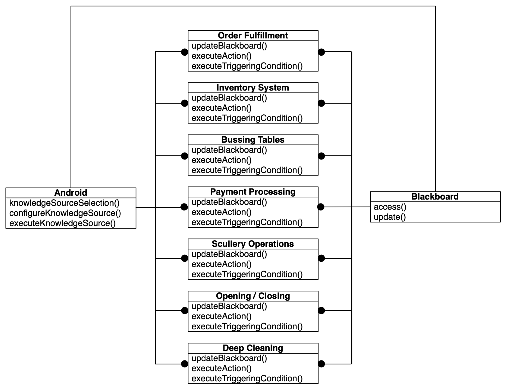
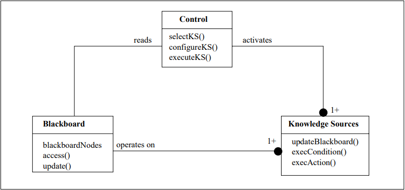

# 黑板模式

[Understanding the blackboard pattern](https://subscription.packtpub.com/book/application-development/9781789809770/9/ch09lvl1sec66/understanding-the-blackboard-pattern)

[Two complementary patterns to build multi-expert systems](https://hillside.net/plop/plop97/Proceedings/lalanda.pdf)

[Blackboard Architecture](http://users.encs.concordia.ca/~gregb/home/PDF/soen6461_blackboard_arch.pdf)

参考

[blackboard -- C# Sample](https://riptutorial.com/design-patterns/example/22355/csharp-sample)

