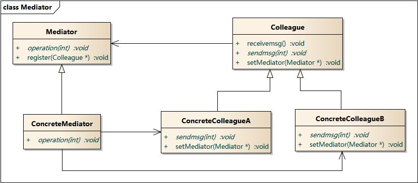

* content
{:toc}

本文介绍中介者模式定义、结构、特点、适用场景、代码实现。

# 中介者模式

## 1 模式的定义

中介者模式(Mediator Pattern)定义：用一个中介对象来封装一系列的对象交互，中介者使各对象不需要显式地相互引用，从而使其耦合松散，而且可以独立地改变它们之间的交互。中介者模式又称为调停者模式，它是一种对象行为型模式。

## 2 模式的结构

### 2.1 结构图

### 2.2 参与者

1. Mediator： 抽象中介者。定义一个接口，该接口用于与各同事对象之间的通信。
2. ConcreteMediator：具体中介者。是抽象中介者的子类，通过协调各个同事对象来实现协作行为，了解并维护它的各个同事对象的引用。
3. Colleague：抽象同事类。定义各同事的公有方法。
4. ConcreteColleague：具体同事类。是抽象同事类的子类，每一个同事对象都引用一个中介者对象，

## 3 模式分析

### 3.1 优点

- 单一职责原则。你可以将多个组件间的交流抽取到同一位置，使其更易于理解和维护。
- 开闭原则。你无需修改实际组件就能增加新的中介者。
- 你可以减轻应用中多个组件间的耦合情况。
- 你可以更方便地复用各个组件。

### 3.2 缺点

- 在具体中介者类中包含了同事之间的交互细节，可能会导致具体中介者类非常复杂，使得系统难以维护。

## 4 适用环境

- 系统中对象之间存在复杂的引用关系，产生的相互依赖关系结构混乱且难以理解。
- 一个对象由于引用了其他很多对象并且直接和这些对象通信，导致难以复用该对象。
- 想通过一个中间类来封装多个类中的行为，而又不想生成太多的子类。可以通过引入中介者类来实现，在中介者中定义对象。
- 交互的公共行为，如果需要改变行为则可以增加新的中介者类。

## 5 实现方式

1. 找到一组当前紧密耦合，且提供其独立性能带来更大好处的类（例如更易于维护或更方便复用）。
2. 声明中介者接口并描述中介者和各种组件之间所需的交流接口。在绝大多数情况下，一个接收组件通知的方法就足够了。如果你希望在不同情景下复用组件类，那么该接口将非常重要。只要组件使用通用接口与其中介者合作，你就能将该组件与不同实现中的中介者进行连接。
3. 实现具体中介者类。该类可从自行保存其下所有组件的引用中受益。
4. 你可以更进一步，让中介者负责组件对象的创建和销毁。此后，中介者可能会与工厂或外观类似。
5. 组件必须保存对于中介者对象的引用。该连接通常在组件的构造函数中建立，该函数会将中介者对象作为参数传递。
6. 修改组件代码，使其可调用中介者的通知方法，而非其他组件的方法。然后将调用其他组件的代码抽取到中介者类中，并在中介者接收到该组件通知时执行这些代码。

## 6 代码实现

[https://github.com/august295/DesignPatternCode](https://github.com/august295/DesignPatternCode)

## 参考

[1] [https://design-patterns.readthedocs.io/zh_CN/latest/behavioral_patterns/mediator.html](https://design-patterns.readthedocs.io/zh_CN/latest/behavioral_patterns/mediator.html)

[2] [https://refactoringguru.cn/design-patterns/mediator](https://refactoringguru.cn/design-patterns/mediator)
