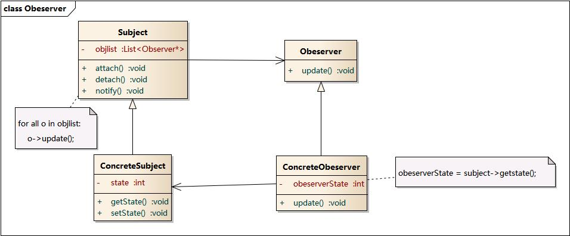

# 观察者模式

## 1 模式的定义

观察者模式(Observer Pattern)：定义对象间的一种一对多依赖关系，使得每当一个对象状态发生改变时，其相关依赖对象皆得到通知并被自动更新。观察者模式又叫做发布-订阅（Publish/Subscribe）模式、模型-视图（Model/View）模式、源-监听器（Source/Listener）模式或从属者（Dependents）模式。

## 2 模式的结构

### 2.1 结构图

### 2.2 参与者

1. Subject: 目标。接口声明了通知接口。 在绝大多数情况下，该接口仅包含一个 update方法。该方法可以拥有多个参数，使发布者能在更新时传递事件的详细信息。
2. ConcreteSubject: 具体目标。可以执行一些操作来回应发布者的通知。 所有具体订阅者类都实现了同样的接口，因此发布者不需要与具体类相耦合。
3. Observer: 观察者。声明注册、注销、通知接口。
4. ConcreteObserver: 具体观察者。实现接口并进行数据操作。

## 3 模式分析

### 3.1 优点

- 观察者模式可以实现表示层和数据逻辑层的分离，并定义了稳定的消息更新传递机制，抽象了更新接口，使得可以有各种各样不同的表示层作为具体观察者角色。
- 观察者模式在观察目标和观察者之间建立一个抽象的耦合。
- 观察者模式支持广播通信。
- 观察者模式符合“开闭原则”的要求。

### 3.2 缺点

- 如果一个观察目标对象有很多直接和间接的观察者的话，将所有的观察者都通知到会花费很多时间。
- 如果在观察者和观察目标之间有循环依赖的话，观察目标会触发它们之间进行循环调用，可能导致系统崩溃。
- 观察者模式没有相应的机制让观察者知道所观察的目标对象是怎么发生变化的，而仅仅只是知道观察目标发生了变化。

## 4 适用环境

- 一个抽象模型有两个方面，其中一个方面依赖于另一个方面。将这些方面封装在独立的对象中使它们可以各自独立地改变和复用。
- 一个对象的改变将导致其他一个或多个对象也发生改变，而不知道具体有多少对象将发生改变，可以降低对象之间的耦合度。
- 一个对象必须通知其他对象，而并不知道这些对象是谁。
- 需要在系统中创建一个触发链，A对象的行为将影响B对象，B对象的行为将影响C对象……，可以使用观察者模式创建一种链式触发机制。

## 5 实现方式

1. 仔细检查你的业务逻辑，试着将其拆分为两个部分：独立于其他代码的核心功能将作为发布者；其他代码则将转化为一组订阅类。
2. 声明订阅者接口。该接口至少应声明一个 update 方法。
3. 声明发布者接口并定义一些接口来在列表中添加和删除订阅对象。记住发布者必须仅通过订阅者接口与它们进行交互。
4. 确定存放实际订阅列表的位置并实现订阅方法。通常所有类型的发布者代码看上去都一样，因此将列表放置在直接扩展自发布者接口的抽象类中是显而易见的。具体发布者会扩展该类从而继承所有的订阅行为。但是，如果你需要在现有的类层次结构中应用该模式，则可以考虑使用组合的方式： 将订阅逻辑放入一个独立的对象，然后让所有实际订阅者使用该对象。
5. 创建具体发布者类。每次发布者发生了重要事件时都必须通知所有的订阅者。
6. 在具体订阅者类中实现通知更新的方法。绝大部分订阅者需要一些与事件相关的上下文数据。这些数据可作为通知方法的参数来传递。但还有另一种选择。订阅者接收到通知后直接从通知中获取所有数据。在这种情况下，发布者必须通过更新方法将自身传递出去。另一种不太灵活的方式是通过构造函数将发布者与订阅者永久性地连接起来。
7. 客户端必须生成所需的全部订阅者，并在相应的发布者处完成注册工作。

## 6 代码实现

[https://github.com/august295/DesignPatternCode](https://github.com/august295/DesignPatternCode)

## 参考

[1] [https://refactoringguru.cn/design-patterns/observer](https://refactoringguru.cn/design-patterns/observer)

[2] [https://design-patterns.readthedocs.io/zh_CN/latest/behavioral_patterns/observer.html](https://design-patterns.readthedocs.io/zh_CN/latest/behavioral_patterns/observer.html)
