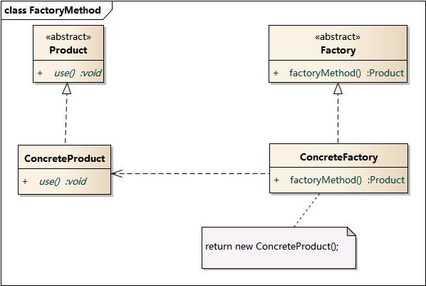

# 工厂方法模式

## 1 模式的定义

工厂方法模式(Factory Method Pattern)又称为工厂模式，也叫虚拟构造器(Virtual Constructor)模式或者多态工厂(Polymorphic Factory)模式，它属于类创建型模式。在工厂方法模式中，工厂父类负责定义创建产品对象的公共接口，而工厂子类则负责生成具体的产品对象，这样做的目的是将产品类的实例化操作延迟到工厂子类中完成，即通过工厂子类来确定究竟应该实例化哪一个具体产品类。

## 2 模式的结构

### 2.1 结构图

### 2.2 参与者

1. **产品**（Product）将会对接口进行声明。对于所有由创建者及其子类构建的对象，这些接口都是通用的。
2. **具体产品**（Concrete Products）是产品接口的不同实现。
3. **创建者**（Creator）类声明返回产品对象的工厂方法。该方法的返回对象类型必须与产品接口相匹配。 你可以将工厂方法声明为抽象方法，强制要求每个子类以不同方式实现该方法。或者，你也可以在基础工厂方法中返回默认产品类型。注意，尽管它的名字是创建者，但他最主要的职责并**不是**创建产品。一般来说，创建者类包含一些与产品相关的核心业务逻辑。工厂方法将这些逻辑处理从具体产品类中分离出来。打个比方，大型软件开发公司拥有程序员培训部门。但是，这些公司的主要工作还是编写代码，而非生产程序员。
4. **具体创建者**（Concrete Creators） 将会重写基础工厂方法，使其返回不同类型的产品。注意，并不一定每次调用工厂方法都会**创建**新的实例。

## 3 模式分析

工厂方法模式是简单工厂模式的进一步抽象和推广。由于使用了面向对象的多态性，工厂方法模式保持了简单工厂模式的优点，而且克服了它的缺点。在工厂方法模式中，核心的工厂类不再负责所有产品的创建，而是将具体创建工作交给子类去做。这个核心类仅仅负责给出具体工厂必须实现的接口，而不负责哪一个产品类被实例化这种细节，这使得工厂方法模式可以允许系统在不修改工厂角色的情况下引进新产品。

## 4 适用环境

- 一个类不知道它所需要的对象的类：在工厂方法模式中，客户端不需要知道具体产品类的类名，只需要知道所对应的工厂即可，具体的产品对象由具体工厂类创建；客户端需要知道创建具体产品的工厂类。
- 一个类通过其子类来指定创建哪个对象：在工厂方法模式中，对于抽象工厂类只需要提供一个创建产品的接口，而由其子类来确定具体要创建的对象，利用面向对象的多态性和里氏代换原则，在程序运行时，子类对象将覆盖父类对象，从而使得系统更容易扩展。
- 将创建对象的任务委托给多个工厂子类中的某一个，客户端在使用时可以无须关心是哪一个工厂子类创建产品子类，需要时再动态指定，可将具体工厂类的类名存储在配置文件或数据库中。

## 5 代码实现

[https://github.com/august295/DesignPatternCode](https://github.com/august295/DesignPatternCode)

## 参考

[1] [https://refactoringguru.cn/design-patterns/factory-method](https://refactoringguru.cn/design-patterns/factory-method)

[2] [https://design-patterns.readthedocs.io/zh_CN/latest/creational_patterns/factory_method.html](https://design-patterns.readthedocs.io/zh_CN/latest/creational_patterns/factory_method.html)
