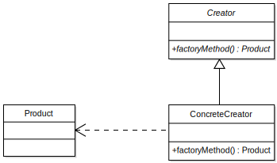

# 工厂方法

## 1 模式的定义

工厂方法模式(Factory Method Pattern)又称为工厂模式，也叫虚拟构造器(Virtual Constructor)模式或者多态工厂(Polymorphic Factory)模式，它属于类创建型模式。在工厂方法模式中，工厂父类负责定义创建产品对象的公共接口，而工厂子类则负责生成具体的产品对象，这样做的目的是将产品类的实例化操作延迟到工厂子类中完成，即通过工厂子类来确定究竟应该实例化哪一个具体产品类。

## 2 模式的结构

### 2.1 结构图

### 2.2 结构角色

主要角色如下。

1. **产品**（Product）将会对接口进行声明。对于所有由创建者及其子类构建的对象，这些接口都是通用的。

2. **具体产品**（Concrete Products）是产品接口的不同实现。

3. **创建者**（Creator）类声明返回产品对象的工厂方法。该方法的返回对象类型必须与产品接口相匹配。 你可以将工厂方法声明为抽象方法，强制要求每个子类以不同方式实现该方法。或者，你也可以在基础工厂方法中返回默认产品类型。注意，尽管它的名字是创建者，但他最主要的职责并**不是**创建产品。一般来说，创建者类包含一些与产品相关的核心业务逻辑。工厂方法将这些逻辑处理从具体产品类中分离出来。打个比方，大型软件开发公司拥有程序员培训部门。但是，这些公司的主要工作还是编写代码，而非生产程序员。

4. **具体创建者**（Concrete Creators） 将会重写基础工厂方法，使其返回不同类型的产品。注意，并不一定每次调用工厂方法都会**创建**新的实例。

