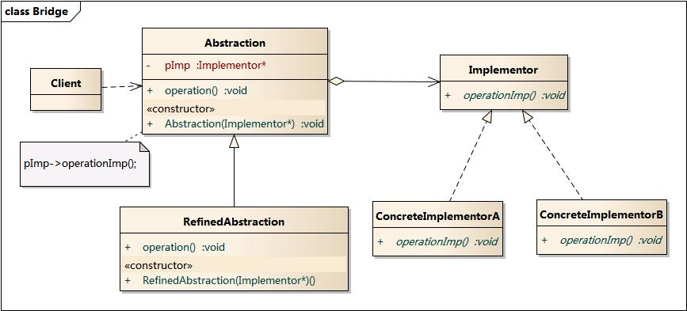

* content
{:toc}

本文介绍桥接模式定义、结构、特点、适用场景、代码实现。

# 桥接模式

## 1 模式的定义

桥接模式(Bridge Pattern)：将抽象部分与它的实现部分分离，使它们都可以独立地变化。它是一种对象结构型模式，又称为柄体(Handle and Body)模式或接口(Interface)模式。

## 2 模式的结构

### 2.1 结构图

### 2.2 参与者

1. 抽象部分（Abstraction）提供高层控制逻辑， 依赖于完成底层实际工作的实现对象。
2. 实现部分（Implementation）为所有具体实现声明通用接口。抽象部分仅能通过在这里声明的方法与实现对象交互。抽象部分可以列出和实现部分一样的方法，但是抽象部分通常声明一些复杂行为，这些行为依赖于多种由实现部分声明的原语操作。
3. 具体实现（Concrete Implementations）中包括特定于平台的代码。
4. 精确抽象（Refined Abstraction）提供控制逻辑的变体。与其父类一样，它们通过通用实现接口与不同的实现进行交互。

## 3 模式分析

### 3.1 优点

- 你可以创建与平台无关的类和程序。
- 客户端代码仅与高层抽象部分进行互动，不会接触到平台的详细信息。
- 开闭原则。你可以新增抽象部分和实现部分，且它们之间不会相互影响。
- 单一职责原则。抽象部分专注于处理高层逻辑，实现部分处理平台细节。

### 3.2 缺点

- 桥接模式的引入会增加系统的理解与设计难度，由于聚合关联关系建立在抽象层，要求开发者针对抽象进

## 4 适用环境

- 如果一个系统需要在构件的抽象化角色和具体化角色之间增加更多的灵活性，避免在两个层次之间建立静态的继承联系，通过桥接模式可以使它们在抽象层建立一个关联关系。
- 抽象化角色和实现化角色可以以继承的方式独立扩展而互不影响，在程序运行时可以动态将一个抽象化子类的对象和一个实现化子类的对象进行组合，即系统需要对抽象化角色和实现化角色进行动态耦合。
- 一个类存在两个独立变化的维度，且这两个维度都需要进行扩展。
- 虽然在系统中使用继承是没有问题的，但是由于抽象化角色和具体化角色需要独立变化，设计要求需要独立管理这两者。
- 对于那些不希望使用继承或因为多层次继承导致系统类的个数急剧增加的系统，桥接模式尤为适用。

## 5 代码实现

[https://github.com/august295/DesignPatternCode](https://github.com/august295/DesignPatternCode)

## 参考

[1] [https://design-patterns.readthedocs.io/zh_CN/latest/structural_patterns/bridge.html](https://design-patterns.readthedocs.io/zh_CN/latest/structural_patterns/bridge.html)

[2] [https://refactoringguru.cn/design-patterns/bridge](https://refactoringguru.cn/design-patterns/bridge)
